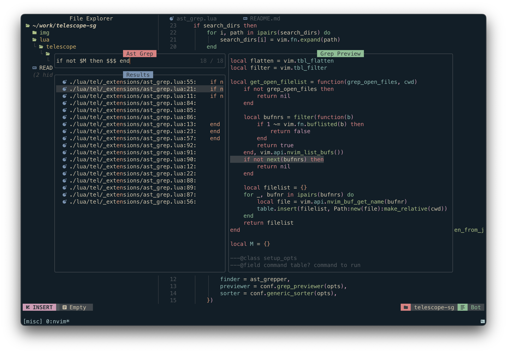

# Telescope ast-grep

Ast-grep picker for telescope.nvim



## Requires
  `ast-grep` to be installed

## What it does
  ast-grep is a AST-based tool to search code by pattern code. Think it as your old-friend grep but it matches AST nodes instead of text. You can write patterns as if you are writing ordinary code. It will match all code that has the same syntactical structure. You can use $ sign + upper case letters as wildcard, e.g. $MATCH, to match any single AST node. Think it as REGEX dot ., except it is not textual.

See [ast-grep](https://https://github.com/ast-grep/ast-grep)

## Configuration

```lua
require('telescope').setup {
    extensions = {
        ast_grep = {
            grep_open_files = false, -- search in opened files
            lang = nil, -- string value, sepcify language for ast-grep `nil` for default
            json_output = false -- not implemented yet
        }
    }
}
```
